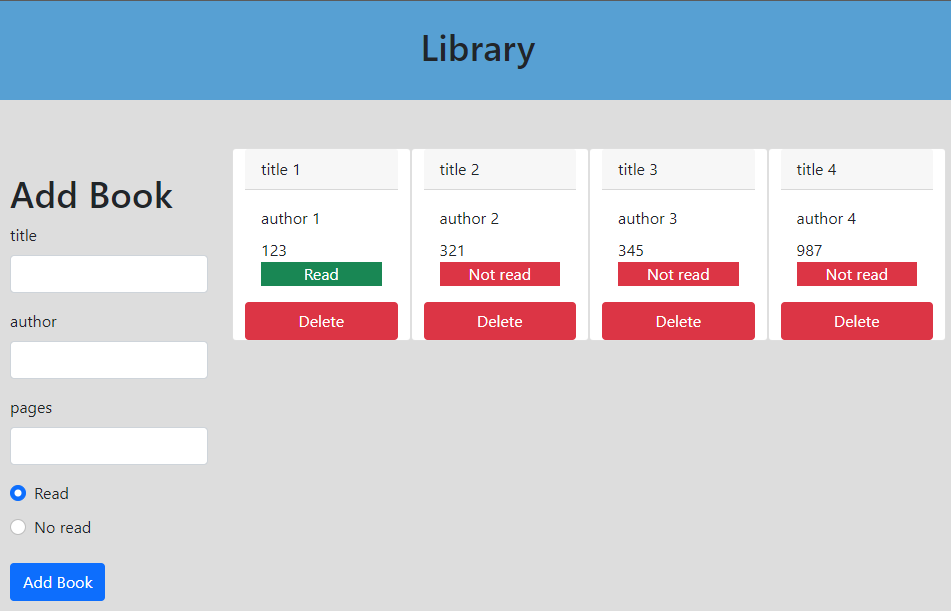

# Library

> This is a Library where the user will be able to add a new book to his collection locally

## :red_circle: Live Demo:

[Live Demo Link](https://kcotrinam.github.io/lib/)

## :hammer: Built with

- HTML5
- CSS3
- JavaScript
- Linters
- VS code

## :construction_worker: Getting Started

To get a local copy up and running follow these simple steps:

1. Go to the [repository page](https://github.com/kcotrinam/Library/).
2. Press the "Code" button and copy the link.
3. Clone it using git command `git clone <link>`.

## :bust_in_silhouette: Author

👤 **Kenvin Cotrina**

- GitHub: [kcotrinam](https://github.com/kcotrinam) 
- Twitter: [@kcotrinam_dev](https://twitter.com/kcotrinam_dev)
- LinkedIn: [KevinCotrina](https://www.linkedin.com/in/kevincotrina/ )

👤 **Kenvin Cotrina**

- Github: [karthick](https://github.com/karthykarthick)
- Twitter: [@Karthic81367745](https://twitter.com/Karthic81367745)
- LinkedIn: [karthick harimoorthy](https://www.linkedin.com/in/karthick-harimoorthy/)

## 🤝 :raised_hand: :raised_hand: Contributions

Contributions, issues, and feature requests are welcome!

Feel free to check the [issues page](https://github.com/kcotrinam/Library/issues).

## :muscle: Show your support

Give a ⭐️ if you like this project!

## :grey_exclamation: Acknowledgment

- [Microverse](https://www.microverse.org/)
- [Odin Project](https://www.theodinproject.com/)
- Stand up teams

 ## 📝 License

This project is [MIT](LICENSE) licensed.
